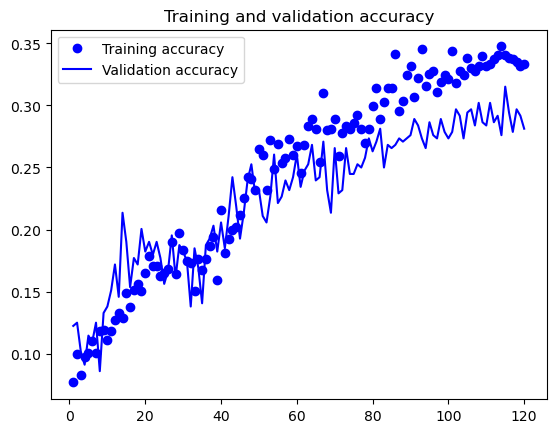
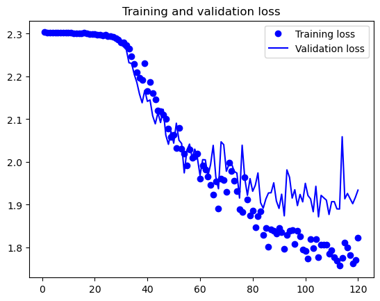

# Image Classification using AlexNet with Tiny ImageNet

This project demonstrates the training of an image classification model on a subset of the Tiny ImageNet dataset. Due to hardware limitations, the dataset was downscaled to include only 100 images from 10 classes out of the original 200 classes with approximately 10,000 images in each class.

## Author

Fatima Azfar

## Dataset

The dataset used is **ImageNet**, downloaded from the official ImageNet platform after registration. The original Tiny ImageNet dataset was too large for the system to train on efficiently, so it was downscaled to a more manageable size.

## Prerequisites

Before running the script, ensure you have the following installed:
- Python 3.6+
- TensorFlow
- Numpy
- Matplotlib

## Installation

To setup your environment for running these scripts, follow these steps:

1. Clone the repository to your local machine.
2. Install the required dependencies:
   ```bash
   pip install tensorflow numpy matplotlib
   ```

## Usage

The project is structured as follows:

- `load_dataset`: Function to load the dataset from a specified directory, either as training or validation data. It allows selection of a specific subset of classes and limits the number of images per class.
- `alexnet_model`: Function that defines the AlexNet model architecture adapted for the dimensions of the Tiny ImageNet dataset.
- `lr_schedule`: Function to adjust the learning rate over epochs during training.

## Model Training

The model training includes data augmentation techniques such as random rotations, shifts, shear, zoom, and horizontal flipping. The optimizer used is SGD with momentum, and a learning rate schedule is applied.

## Evaluation

After training, the script will plot the training and validation accuracy and loss, providing insights into the model's learning process. Additionally, it calculates the top-1 and top-5 error rates on the validation set.





## Results

The final section of the script outputs the validation top-1 and top-5 error rates and accuracies, offering a comprehensive overview of the model's performance on unseen data.
Validation Top-1 Error Rate: 0.706
Validation Top-1 Accuracy: 0.29400000000000004
Validation Top-5 Error Rate: 0.216
Validation Top-5 Accuracy: 0.784

## References

Krizhevsky, A., Sutskever, I., & Hinton, G. E. (2012). ImageNet Classification with Deep Convolutional Neural Networks. *Proceedings of the 25th International Conference on Neural Information Processing Systems* (NIPS 2012), University of Toronto. This seminal paper details the training of a large, deep convolutional neural network, achieving state-of-the-art results in classifying 1.2 million high-resolution images into 1000 different classes from the ImageNet LSVRC-2010 contest.

## Note

This project was designed for educational purposes and to demonstrate image classification techniques on a subset of the Tiny ImageNet dataset. The choice of dataset size and classes was made based on the available system resources.
